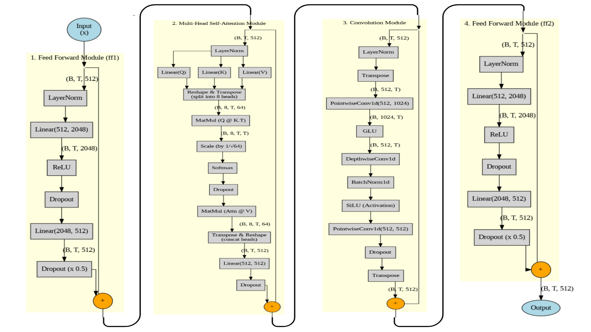

# 🎙️ Conformer-ASR

A **Conformer-based end-to-end speech recognition system**.  
It utilizes a **Conformer encoder**, which integrates **convolutional** and **transformer** architectures to capture both local and global acoustic dependencies.The system employs a **CTC decoder** to align input speech frames with output text sequences without requiring explicit frame-level annotations.

---

## Model Architecture



## 
To run the **Conformer-ASR** project, you need to first **clone the repository**, **install the dependencies**, and then execute the main scripts for **training** or **testing**.

```bash
git clone https://github.com/antonioroger2/Conformer-ASR.git
cd Conformer-ASR/ASR  # Navigate to the ASR directory
````

Install the required Python packages.
If you have a CUDA-compatible GPU, install the corresponding CUDA-enabled PyTorch version for best performance.

```bash
pip install torch torchaudio numpy tqdm jiwer
```

Download **LibriSpeech** dataset (eg. `train-clean-100` and `test-clean`) in the specified directories


Run the training script to start model training.
This trains the **Conformer-CTC** model, saves checkpoints, and reports validation **WER** and **CER**.

```bash
# Option 1: Use default data paths (from configs/config.py)
python train.py

# Option 2: Specify custom data paths
python train.py \
    --train_path /path/to/librispeech/train-clean-100 \
    --test_path /path/to/librispeech/test-clean
```

**Checkpoint Outputs:**

* `working/checkpoints/latest_checkpoint.pth` → last saved state
* `working/checkpoints/best_model.pth` → lowest validation loss
* `working/checkpoints/final_model.pth` → final trained model (used for testing)


After training, run the test script to evaluate and transcribe random samples from the test dataset.

```bash
# Option 1: Use default model and test data paths
python test.py

# Option 2: Specify paths manually
python test.py \
    --model_path /ASR/working/checkpoints/final_model.pth \
    --data_dir /path/to/librispeech/test-clean \
    --num_samples 10
```

**Rgds [Antonio Roger](https://github.com/antonioroger2)**

**Source : [conformer](https://github.com/jreremy/conformer)**


